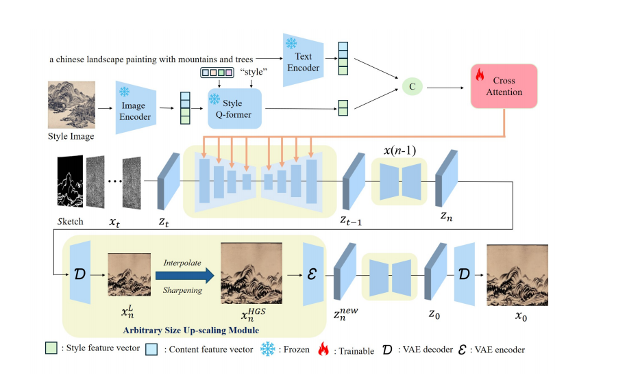
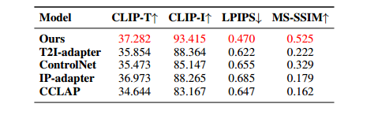
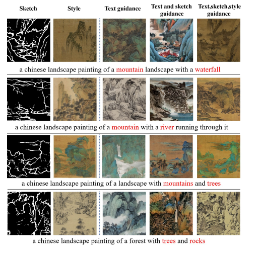
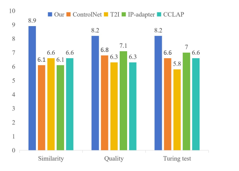

# ASMCC-Diff: Arbitrary Size Multi-Condition Controllable Chinese Landscape Painting Generation with Diffusion Models


## Abstract
Abstract—Thanks to the emergence of generative models, Chinese Landscape Painting Generation (CLPG) has garnered increasing attention. However, existing works are primarily limited to relying on text control conditions, lacking more finegrained control over spatial layout and style. Additionally, the generated image size is fixed. But different landscape scenes require different sizes to appear more balanced and natural. Thus, a question arises: Is it possible to design a model that support multiple conditions (text, style and sketches) while generate images with various sizes? In this paper, we explore this issue and propose ASMCC-Diff. Specifically, it consists of two modules, i.e. multicondition controlled image generation module and arbitrary size up-scaling module. The critical insights of multi-condition controlled image generation module is to embed multiple conditions with distinct priorities. The sketch condition serves as the primary flow, guiding the overall structure, while the text and style conditions act as auxiliary components, injected into the diffusion model via a cross-attention module. Additionally, to avoid conflicts between the semantics of style images and text, we use Q-Former to separate the semantic and stylistic information of the reference image. For the arbitrary size upscaling module, we first truncate the generation process, upsample the image to the specified size, and then continue the generation. Moreover, a new Chinese landscape painting database that supports multiple conditions has been proposed to facilitate further research. Experimental results in single-condition and multiple-condition cases have demonstrated the superior ability of our proposed model. Our code will be released.

## Approaches

<p align="center">
  
<br>
</p>

## Results

- Quantitative Comparison


<p align="center">
  
<br>
</p>


- Ablation Analysis
<p align="center">
  
<br>
</p>

- User preference
<p align="center">
  
<br>
</p>

## Cite

```
@article{ASMCC-Diff,
  author = {NorthWest Universiiy Team},
  title  = {ASMCC-Diff GitHub Page},
  year   = {2025}
}
```

