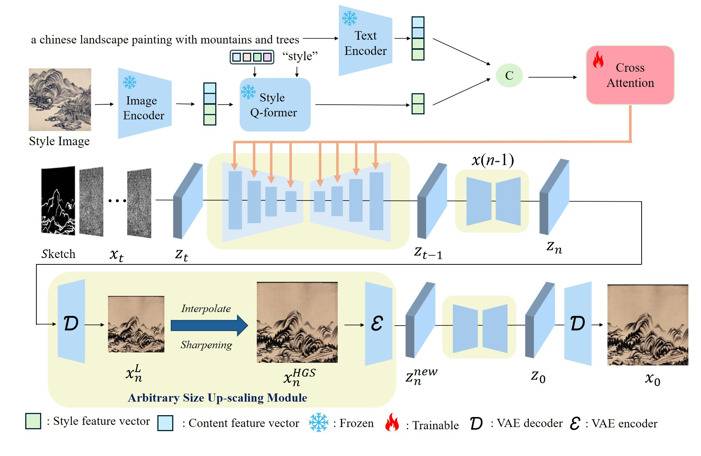

# ASMCC-Diff: Arbitrary Size Multi-Condition Controllable Chinese Landscape Painting Generation with Diffusion Models


## 🔆Abstract
Chinese Landscape Painting Generation (CLPG) has garnered increasing attention in recent years. However, existing works are primarily limited to relying on text-based control conditions and the generated image size is fixed. This raises the question: Is it possible to design a model that support multiple conditions (text, style and sketches) while generate images with various sizes? In this paper, we explore this issue and propose ASMCC-Diff. Specifically, the model consists of two key modules: the multi condition controlled image generation module and the arbitrary size up-scaling module. The former embeds multiple conditions with distinct priorities, avoiding conflicts between the different conditions. The latter controls the size of the generated image. Furthermore, we introduce a new Chinese landscape painting database that supports multiple conditions, facilitating further research. Experimental results demonstrate the superior performance of our proposed model. The data and code will be released.

## 🧠Approaches

<p align="center">
  
<br>
</p>


## 📊Results


<p align="center">
  
<br>
</p>


<p align="center">
  
<br>
</p>


## ⚙️ Setup


## ⏳ TODO

- [x] Release training data.
- [ ] Release the training code.
- [ ] Release the inference code.


## 🔗Cite

```
@article{ASMCC-Diff,
  author = {NorthWest Universiiy Team},
  title  = {ASMCC-Diff GitHub Page},
  year   = {2025}
}
```

